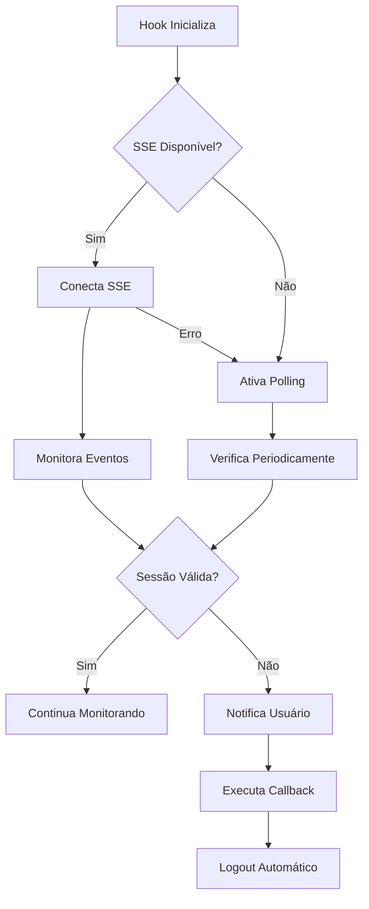

# Hook useProtectedSession - Documentação

## ✅ Arquivos Criados
1. `/src/hooks/useProtectedSession.ts` - Hook principal
2. `/src/app/dashboard/test-protected/page.tsx` - Página de exemplo/teste

## 📋 O que é o useProtectedSession?

Um hook React customizado que fornece proteção completa de sessão com:
- ✅ Verificação automática de validade
- ✅ Conexão SSE para tempo real
- ✅ Fallback para polling se SSE falhar
- ✅ Notificações visuais ao usuário
- ✅ Logout automático quando invalidada
- ✅ Estados de loading e conexão

## 🎯 Como Usar

### Uso Básico
```typescript
import { useProtectedSession } from '@/hooks/useProtectedSession'

function MyProtectedPage() {
  const { isValid, isLoading, isConnected } = useProtectedSession()

  if (isLoading) return <div>Carregando...</div>
  if (!isValid) return <div>Sessão inválida</div>

  return (
    <div>
      {isConnected && <span>🟢 Proteção ativa</span>}
      {/* Seu conteúdo protegido */}
    </div>
  )
}
```

### Uso Avançado com Opções
```typescript
const {
  isValid,
  isLoading,
  isConnected,
  lastCheck,
  invalidationReason,
  session,
  userId,
  checkNow,
  disconnect
} = useProtectedSession({
  // Opções configuráveis
  pollingInterval: 5000,        // Verificar a cada 5s se SSE falhar
  showNotifications: true,       // Mostrar toasts
  redirectTo: '/login',         // Para onde redirecionar
  enableSSE: true,              // Usar Server-Sent Events
  enablePolling: true,          // Usar polling como fallback
  
  // Callback customizado
  onSessionInvalidated: (reason) => {
    console.log('Sessão invalidada:', reason)
    // Limpar cache local
    localStorage.clear()
    // Limpar dados do Redux/Zustand
    // etc...
  }
})
```

## 📊 Propriedades Retornadas

| Propriedade | Tipo | Descrição |
|------------|------|-----------|
| `isValid` | boolean | Se a sessão está válida |
| `isLoading` | boolean | Se está verificando sessão |
| `isConnected` | boolean | Se SSE está conectado |
| `lastCheck` | Date \| null | Última verificação realizada |
| `invalidationReason` | string \| null | Motivo da invalidação |
| `session` | Session \| null | Objeto da sessão NextAuth |
| `userId` | string \| undefined | ID do usuário atual |
| `checkNow` | () => void | Força verificação imediata |
| `disconnect` | () => void | Desconecta SSE |

## ⚙️ Opções de Configuração

| Opção | Tipo | Padrão | Descrição |
|-------|------|--------|-----------|
| `pollingInterval` | number | 10000 | Intervalo de polling em ms |
| `showNotifications` | boolean | true | Mostrar notificações toast |
| `redirectTo` | string | '/login' | URL de redirecionamento |
| `enableSSE` | boolean | true | Habilitar Server-Sent Events |
| `enablePolling` | boolean | true | Habilitar polling como fallback |
| `onSessionInvalidated` | function | undefined | Callback quando invalidada |

## 🔄 Fluxo de Funcionamento



## 🧪 Como Testar

### 1. Página de Teste
Acesse `/dashboard/test-protected` após fazer login para ver o hook em ação.

### 2. Teste Manual
1. Faça login no sistema
2. Use o hook em qualquer componente
3. Faça login em outro navegador com mesmo usuário
4. Observe a detecção automática em ~2 segundos

### 3. Simular Falha do SSE
```typescript
// Force o uso de polling desabilitando SSE
useProtectedSession({
  enableSSE: false,  // Desabilita SSE
  enablePolling: true,
  pollingInterval: 3000 // Verifica a cada 3s
})
```

## 📈 Performance

### Com SSE (Padrão)
- **Detecção**: ~2 segundos
- **Requisições**: 1 conexão persistente
- **CPU**: Baixo uso
- **Rede**: Mínimo tráfego

### Com Polling (Fallback)
- **Detecção**: Depende do intervalo (padrão 10s)
- **Requisições**: 1 a cada intervalo
- **CPU**: Uso moderado
- **Rede**: Tráfego regular

## 🔒 Segurança

- ✅ Verificação server-side via API
- ✅ Token de sessão validado no banco
- ✅ Logout automático forçado
- ✅ Limpeza de estados ao desmontar
- ✅ Tratamento de erros robusto

## 💡 Casos de Uso

### 1. Páginas Administrativas
```typescript
// /dashboard/admin/page.tsx
export default function AdminPage() {
  const { isValid, isLoading } = useProtectedSession({
    redirectTo: '/login?error=unauthorized'
  })
  
  if (!isValid) return null
  // ...
}
```

### 2. Modais Sensíveis
```typescript
function DeleteUserModal({ isOpen, onClose }) {
  const { isValid } = useProtectedSession({
    showNotifications: false, // Sem toasts em modais
    onSessionInvalidated: () => {
      onClose() // Fecha modal se sessão invalidar
    }
  })
  
  if (!isValid) {
    onClose()
    return null
  }
  // ...
}
```

### 3. Formulários Críticos
```typescript
function BankTransferForm() {
  const { isValid, checkNow } = useProtectedSession()
  
  const handleSubmit = async (data) => {
    // Verificar sessão antes de enviar
    await checkNow()
    
    if (!isValid) {
      alert('Sessão expirada. Faça login novamente.')
      return
    }
    
    // Enviar dados...
  }
  // ...
}
```

## 🎨 Integração com UI

### Indicador de Status
```typescript
function SessionStatus() {
  const { isConnected, lastCheck } = useProtectedSession()
  
  return (
    <div className="flex items-center gap-2">
      {isConnected ? (
        <span className="flex items-center gap-1 text-green-600">
          <WifiIcon className="h-4 w-4" />
          Proteção Ativa
        </span>
      ) : (
        <span className="flex items-center gap-1 text-orange-600">
          <WifiOffIcon className="h-4 w-4" />
          Modo Offline
        </span>
      )}
      {lastCheck && (
        <span className="text-xs text-gray-500">
          Verificado: {lastCheck.toLocaleTimeString()}
        </span>
      )}
    </div>
  )
}
```

## 🚀 Próximos Passos

O sistema de sessão única está completo com:
1. ✅ Trigger no banco
2. ✅ API de validação
3. ✅ Server-Sent Events
4. ✅ Hook useProtectedSession

Para integrar completamente:
1. Substituir o SessionMonitor atual pelo hook
2. Aplicar o hook em páginas sensíveis
3. Remover o polling antigo do SessionMonitor
4. Adicionar indicadores visuais de proteção