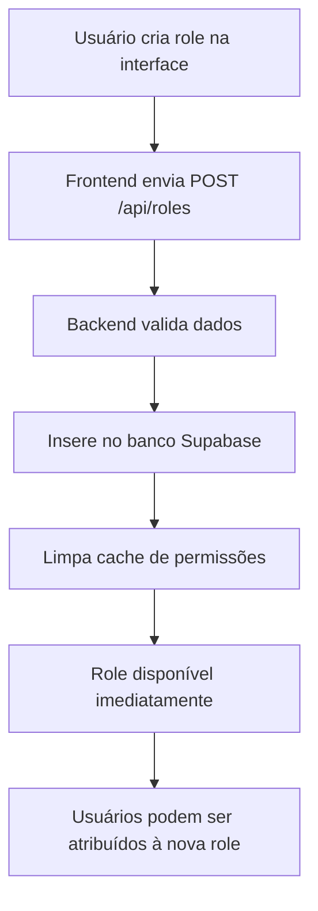

# 📚 Guia do Sistema de Roles (Perfis)

## ✅ **SIM! O sistema cria roles automaticamente no banco!**

### Como Funciona:

1. **Via Interface (Recomendado)**:
   - Vá em **Configurações → Gerenciar Perfis**
   - Clique em **"Criar Novo Perfil"**
   - Preencha:
     - **Nome**: ex: "N1" (será convertido para "n1" internamente)
     - **Nome de Exibição**: ex: "Suporte Nível 1"
     - **Descrição**: ex: "Atendimento de primeiro nível"
   - Configure as permissões desejadas
   - Clique em **Salvar**
   - **PRONTO! A role é criada automaticamente no banco!**

2. **O que acontece nos bastidores**:
   - A interface chama `/api/roles` (POST)
   - O endpoint insere a role no banco Supabase
   - O cache de permissões é limpo automaticamente
   - A role fica disponível imediatamente

## 🔧 Pré-requisito: Tabela `roles` no Supabase

### Verificar se a tabela existe:
Execute no Supabase SQL Editor:
```sql
SELECT * FROM roles LIMIT 1;
```

### Se a tabela NÃO existir:
Execute o script de migração em `/supabase/migrations/create_roles_table.sql`

## 📝 Exemplos de Criação de Roles

### Via Interface:

#### Exemplo 1: Criar perfil "N1" (Suporte Nível 1)
1. Acesse **Configurações → Gerenciar Perfis**
2. Clique em **"Criar Novo Perfil"**
3. Preencha:
   - Nome: `N1`
   - Nome de Exibição: `Suporte Nível 1`
   - Descrição: `Atendimento inicial e triagem`
4. Configure permissões:
   - ✅ tickets_view
   - ✅ tickets_create
   - ✅ tickets_edit_own
   - ❌ tickets_delete
   - ✅ tickets_assign
   - ❌ tickets_close
5. Salvar

#### Exemplo 2: Criar perfil "supervisor"
1. Mesmo processo
2. Preencha:
   - Nome: `supervisor`
   - Nome de Exibição: `Supervisor`
   - Descrição: `Supervisão de equipe`
3. Configure permissões:
   - ✅ tickets_view
   - ✅ tickets_create
   - ✅ tickets_edit_all
   - ✅ tickets_delete
   - ✅ tickets_assign
   - ✅ tickets_close
   - ✅ timesheets_approve
4. Salvar

## 🚀 Fluxo Completo



## ❓ FAQ

### P: Preciso acessar o banco diretamente?
**R: NÃO!** Tudo é feito pela interface.

### P: A role é salva permanentemente?
**R: SIM!** É salva no banco Supabase.

### P: Posso editar roles depois?
**R: SIM!** Use o botão de editar na interface.

### P: Como atribuir a role a um usuário?
**R:** 
1. Vá em **Usuários**
2. Clique em editar no usuário
3. Selecione a nova role no dropdown
4. Salvar

### P: E se o Supabase não estiver configurado?
**R:** O sistema funciona com cache local temporário, mas as roles não persistirão após restart.

## 🔍 Verificação no Banco

Para confirmar que as roles estão sendo criadas:

```sql
-- Ver todas as roles
SELECT * FROM roles ORDER BY created_at DESC;

-- Ver roles customizadas (não-sistema)
SELECT * FROM roles WHERE is_system = false;

-- Ver quantos usuários tem cada role
SELECT 
  r.display_name,
  COUNT(u.id) as total_users
FROM roles r
LEFT JOIN users u ON u.role_name = r.name
GROUP BY r.display_name;
```

## ⚠️ Troubleshooting

### Erro: "Failed to create role"
- **Causa**: Tabela `roles` não existe
- **Solução**: Execute o script de migração

### Role criada mas não aparece
- **Causa**: Cache não foi limpo
- **Solução**: Clique em "Limpar Cache" e faça logout/login

### Permissões não funcionam
- **Causa**: Usuário não tem a role atribuída
- **Solução**: Edite o usuário e atribua a role correta

## ✨ Resumo

**SIM, o sistema cria roles automaticamente no banco!**

Você pode criar quantas roles quiser (N1, N2, supervisor, gerente, etc.) diretamente pela interface, sem necessidade de acessar o banco de dados ou rodar scripts SQL.

Cada role pode ter suas 24 permissões configuradas individualmente, e as mudanças são aplicadas imediatamente após limpar o cache e fazer novo login.