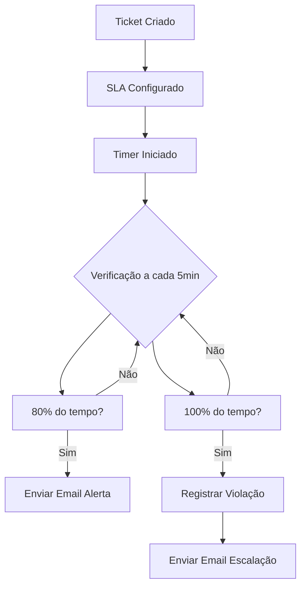

# 📋 Análise do Sistema de Escalação e Formatação de Datas

## 1. 🔍 Problemas Identificados

### 1.1 Sistema de Escalação de Tickets
- **URL mencionada**: https://www.ithostbr.tech/api/test-escalation
- **Status**: API de teste de escalação NÃO ENCONTRADA no código atual
- **Problema Principal**: Emails automáticos não estão sendo enviados quando o tempo configurado é atingido

### 1.2 Formatação de Datas (Timezone)
- **Problema**: Datas de criação e atualização não estão sendo apresentadas no horário de Brasília
- **Localização atual**: As datas estão sendo formatadas com `date-fns` e locale `ptBR`, mas sem conversão de timezone

## 2. 📊 Análise do Sistema SLA Existente

### 2.1 Estrutura do Banco de Dados (Encontrada)

#### Tabelas SLA criadas:
1. **sla_configurations** - Configurações de SLA por prioridade
2. **ticket_sla** - Rastreamento de SLA por ticket
3. **sla_pause_history** - Histórico de pausas
4. **sla_breaches** - Violações de SLA

#### Configurações padrão existentes:
```sql
- Crítico: 30 min resposta, 120 min resolução (24h)
- Alto: 60 min resposta, 240 min resolução (horário comercial)
- Médio: 120 min resposta, 480 min resolução (horário comercial)
- Baixo: 240 min resposta, 960 min resolução (horário comercial)
```

### 2.2 Problemas Identificados no Sistema SLA

#### ❌ **Falta de Sistema de Escalação Automática**
- Não existe cronjob ou worker para verificar SLAs periodicamente
- Não há função para enviar emails quando SLA está próximo de vencer
- Não existe API `/api/test-escalation` implementada

#### ❌ **Falta de Integração com Sistema de Notificações**
- O sistema SLA não está integrado com o sistema de emails
- Não há triggers para notificar quando SLA é violado

## 3. 🕐 Análise do Problema de Timezone

### 3.1 Situação Atual
```typescript
// src/app/dashboard/tickets/[id]/page.tsx - linha 551
format(new Date(ticket.created_at), "dd/MM/yyyy 'às' HH:mm", { locale: ptBR })
```

### 3.2 Problema
- As datas vêm do Supabase em UTC
- São exibidas diretamente sem conversão para horário de Brasília (UTC-3)
- Resultado: Horário mostrado está 3 horas adiantado

## 4. 🛠️ Soluções Necessárias (Sem Implementação)

### 4.1 Para o Sistema de Escalação

#### Criar API de Test-Escalation
```typescript
// src/app/api/test-escalation/route.ts (PRECISA SER CRIADO)
- Verificar tickets com SLA próximo de vencer
- Enviar emails de alerta
- Registrar escalações
```

#### Criar Sistema de Verificação Automática
```typescript
// src/app/api/sla/check/route.ts (PRECISA SER CRIADO)
- Verificar SLAs a cada 5 minutos
- Identificar tickets próximos de violação (80% do tempo)
- Enviar notificações automáticas
```

#### Integrar com Sistema de Email
```typescript
// Adicionar em src/lib/email-service.ts
- Função sendSLAAlertEmail()
- Função sendSLABreachEmail()
- Templates específicos para SLA
```

### 4.2 Para o Problema de Timezone

#### Opção 1: Usar date-fns-tz
```bash
npm install date-fns-tz
```

```typescript
import { format, utcToZonedTime } from 'date-fns-tz'

const brasiliaTime = utcToZonedTime(new Date(ticket.created_at), 'America/Sao_Paulo')
format(brasiliaTime, "dd/MM/yyyy 'às' HH:mm", { locale: ptBR })
```

#### Opção 2: Configurar Supabase para retornar em timezone correto
```sql
-- No Supabase
SET timezone = 'America/Sao_Paulo';
```

#### Opção 3: Criar função helper
```typescript
// src/lib/date-utils.ts
export function formatBrasiliaDate(date: string | Date) {
  const d = new Date(date)
  // Subtrair 3 horas manualmente
  d.setHours(d.getHours() - 3)
  return format(d, "dd/MM/yyyy 'às' HH:mm", { locale: ptBR })
}
```

## 5. 📝 Arquivos que Precisam ser Modificados

### Para Escalação:
1. **Criar**: `/src/app/api/test-escalation/route.ts`
2. **Criar**: `/src/app/api/sla/check/route.ts`
3. **Criar**: `/src/lib/sla-service.ts`
4. **Modificar**: `/src/lib/email-service.ts` (adicionar templates SLA)
5. **Criar**: `/src/app/api/cron/sla-check/route.ts`

### Para Timezone:
1. **Modificar**: `/src/app/dashboard/tickets/[id]/page.tsx`
2. **Modificar**: `/src/app/dashboard/tickets/page.tsx`
3. **Modificar**: `/src/components/TicketCard.tsx`
4. **Criar**: `/src/lib/date-utils.ts`
5. **Modificar**: Qualquer lugar que exiba datas

## 6. 🔄 Fluxo de Escalação Proposto



## 7. 📧 Templates de Email Necessários

### 7.1 Email de Alerta SLA (80%)
```html
Assunto: ⚠️ Alerta SLA - Ticket #XXX próximo do limite

Ticket está em 80% do tempo de SLA
Tempo restante: XX minutos
Prioridade: XXX
```

### 7.2 Email de Violação SLA
```html
Assunto: 🚨 SLA Violado - Ticket #XXX

O SLA foi violado!
Tempo excedido: XX minutos
Ação necessária: Escalação para supervisor
```

## 8. 🔧 Configurações Necessárias no .env

```env
# Timezone
TZ=America/Sao_Paulo
DEFAULT_TIMEZONE=America/Sao_Paulo

# SLA Check Interval (em minutos)
SLA_CHECK_INTERVAL=5
SLA_ALERT_THRESHOLD=80

# Email Settings para SLA
SLA_ESCALATION_EMAIL=supervisor@ithostbr.tech
SLA_CC_EMAILS=gerencia@ithostbr.tech
```

## 9. 🚨 Ações Imediatas Necessárias

1. **Criar API test-escalation** para testar manualmente o sistema
2. **Implementar conversão de timezone** em todas as exibições de data
3. **Criar cronjob/worker** para verificação automática de SLA
4. **Integrar sistema de email** com eventos de SLA
5. **Adicionar logs** para rastrear escalações

## 10. 📊 Query SQL para Verificar SLAs Pendentes

```sql
-- Tickets próximos de violar SLA (80%)
SELECT 
  t.id,
  t.ticket_number,
  t.title,
  t.priority,
  ts.first_response_target,
  ts.resolution_target,
  EXTRACT(EPOCH FROM (ts.first_response_target - NOW())) / 60 as minutes_remaining,
  CASE 
    WHEN EXTRACT(EPOCH FROM (ts.first_response_target - NOW())) / 60 < 
         (sc.first_response_time * 0.2) THEN true
    ELSE false
  END as needs_alert
FROM tickets t
JOIN ticket_sla ts ON t.id = ts.ticket_id
JOIN sla_configurations sc ON ts.sla_configuration_id = sc.id
WHERE ts.first_response_status = 'pending'
  AND t.status NOT IN ('resolved', 'closed', 'cancelled')
ORDER BY minutes_remaining ASC;
```

## 11. ⚠️ Avisos Importantes

- **NÃO ALTERAR** código sem autorização
- Sistema SLA existe parcialmente mas **NÃO está funcional**
- Emails automáticos **NÃO estão implementados**
- Timezone **PRECISA ser corrigido** em todo o sistema
- API test-escalation **NÃO existe** e precisa ser criada

## 12. 📌 Próximos Passos Recomendados

1. **PRIORIDADE 1**: Corrigir timezone (mais simples)
2. **PRIORIDADE 2**: Criar API test-escalation básica
3. **PRIORIDADE 3**: Implementar verificação automática de SLA
4. **PRIORIDADE 4**: Integrar com sistema de emails
5. **PRIORIDADE 5**: Adicionar interface para visualizar SLAs

---

**Status Atual**: Sistema SLA criado mas NÃO operacional. Aguardando autorização para implementar correções.