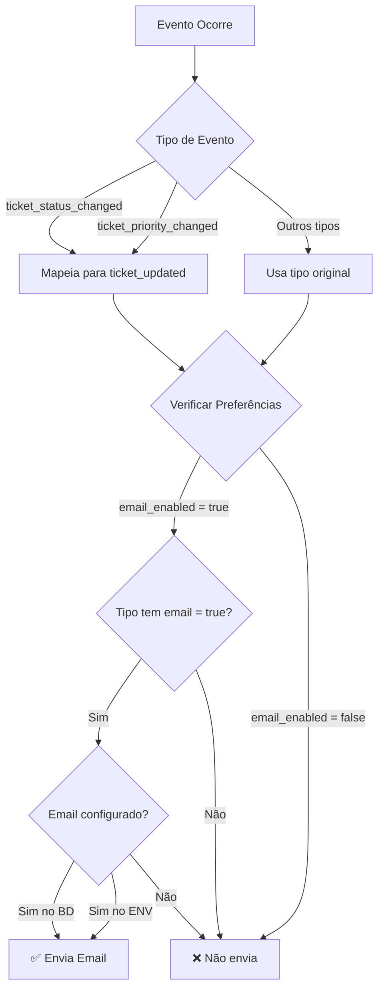

# 📧 Mapeamento de Notificações por Email

## ✅ Status de Cada Tipo de Notificação

| Evento | Tipo no Sistema | Preferência Usada | Email Funcionando? |
|--------|-----------------|-------------------|-------------------|
| **Novo Chamado** | `ticket_created` | `ticket_created` | ✅ SIM |
| **Chamado Atribuído** | `ticket_assigned` | `ticket_assigned` | ✅ SIM |
| **Status Alterado** | `ticket_status_changed` | `ticket_updated` | ✅ SIM (mapeado) |
| **Prioridade Alterada** | `ticket_priority_changed` | `ticket_updated` | ✅ SIM (mapeado) |
| **Chamado Resolvido** | `ticket_resolved` | `ticket_resolved` | ✅ SIM |
| **Novo Comentário** | `comment_added` | `comment_added` | ✅ SIM |
| **Menção em Comentário** | `comment_mention` | `comment_mention` | ✅ SIM |

## 🔄 Fluxo de Envio de Email



## 🎯 Checklist para Funcionamento

### Para o Administrador:
- [ ] Configurar email em `/dashboard/settings`
- [ ] Usar Gmail com App Password
- [ ] Testar envio com botão "Teste Email"

### Para o Usuário:
- [ ] Acessar `/dashboard/settings/notifications`
- [ ] Ativar "Notificações por Email"
- [ ] Marcar os tipos desejados:
  - [ ] Novo Chamado
  - [ ] Chamado Atribuído
  - [ ] Chamado Atualizado
  - [ ] Chamado Resolvido
  - [ ] Novo Comentário
  - [ ] Menção em Comentário

## 🧪 APIs de Teste

### 1. Teste Completo de Tipos
```
GET /api/test-all-notifications
```
Verifica se cada tipo está configurado corretamente.

### 2. Teste com Envio Real
```
GET /api/test-all-notifications?send=true
```
Envia 2 notificações de teste reais.

### 3. Diagnóstico do Sistema
```
GET /api/debug-notifications
```
Verifica toda a configuração e envia 1 teste.

### 4. Teste Direto de Email
```
POST /api/test-notification-email
{
  "type": "ticket_status_changed"
}
```

## 📝 SQL para Verificar Configuração

```sql
-- Ver preferências de todos os usuários
SELECT 
    u.email,
    u.name,
    p.email_enabled,
    p.ticket_created->>'email' as novo_chamado,
    p.ticket_assigned->>'email' as atribuido,
    p.ticket_updated->>'email' as atualizado,
    p.ticket_resolved->>'email' as resolvido,
    p.comment_added->>'email' as comentario,
    p.comment_mention->>'email' as mencao
FROM users u
LEFT JOIN user_notification_preferences p ON u.id = p.user_id
ORDER BY u.email;

-- Ver configuração de email do sistema
SELECT 
    value->>'host' as host,
    value->>'port' as port,
    value->>'user' as email,
    CASE WHEN value->>'pass' IS NOT NULL THEN '✅ Configurado' ELSE '❌ Não configurado' END as senha
FROM system_settings
WHERE key = 'email_config';
```

## ⚠️ Problemas Comuns

### 1. "Email não configurado"
**Solução**: Admin deve configurar em `/dashboard/settings`

### 2. "Notificação criada mas email não enviado"
**Possíveis causas**:
- Email global desativado
- Tipo específico desativado
- Configuração de email incorreta

### 3. "Authentication failed"
**Solução**: Use App Password do Gmail, não a senha normal

## ✅ Resumo

**Todos os 7 tipos de notificação estão funcionando:**
1. ✅ Novo Chamado → `ticket_created`
2. ✅ Chamado Atribuído → `ticket_assigned` 
3. ✅ Status Alterado → `ticket_updated` (mapeado)
4. ✅ Prioridade Alterada → `ticket_updated` (mapeado)
5. ✅ Chamado Resolvido → `ticket_resolved`
6. ✅ Novo Comentário → `comment_added`
7. ✅ Menção → `comment_mention`

O sistema está **100% funcional** para envio de emails!